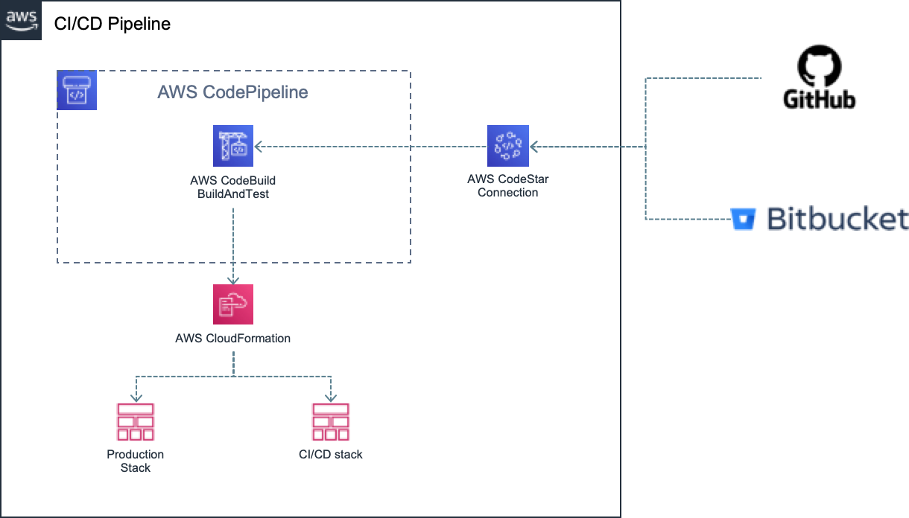

# CI/CD pipeline in AWS

This is an [AWS CDK](https://aws.amazon.com/cdk/?nc1=h_ls) project that holds the IaC to deploy a CI/CD pipeline to AWS CodePipeline.

The generated CloudFormation template has been adapted to Serverless Framework in the sense it is granted with AWS permissions to deploy Serverless Framework projects. You may want to adapt it to your own needs. Also, if your particular project makes use of any AWS managed services, you must adapt `buildServicesDependentPermissions` function in `lib/cicd-stack.ts`; so you grant access the build process to those services.

Roughtly speaking, this pipeline monitors a concrete branch of a git repository (both Github and Bitbucket repositories are supported). Whenever new commits come in that branch, the build process is triggered. All tests (unit, integration and e2e) are run locally. If they passed, an actual `cicd` environment is created/updated in AWS; and e2e tests are run against it. If they keep passing, then the code is deployed to a production environment (`pro`).



---
**NOTE**

If you want to change the steps of the build process, just edit `buildspec.yml` file to fit your needs.

---
## Prerequisites

* [node](https://nodejs.org/en/download/) (v14+)

* [yarn](https://classic.yarnpkg.com/lang/en/docs/install/)

## Setup

This package does not rely on dotenv files as the only environment parameter is the AWS profile you want to use. So, instead of having such files, just pass the CDK param `--profile` to indicate which AWS profile the CDK must use. If you don't define it, then the CDK will use the default profile.

## Deploy to AWS

> TLTR -> `yarn cdk deploy -c provider=<provider> -c repository=<repository-url> -c services=<comma-separated list of services> --parameters DockerhubUsername=<username> --parameters DockerhubPassword=<password> --profile <aws-profile>`

---
**NOTE**

If this is the first time you use AWS CDK in a given AWS account, then don't forget to bootstrap it!

```sh
yarn cdk bootstrap --profile <aws-profile>
```

---

AWS CDK commands require some mandatory _context parameters_. In particular, you must provide:

* **provider**: which source provider hosts the code (either `Bitbucket` or `GitHub`).
* **repository**: the repository and branch that triggers the pipeline. It's in the format `owner/repository#branch`. For instance `cjuega/typescript-fullstack-skeleton#master`.
* **services**: a list of services the CI/CD pipeline will have access to (separated by commas). For instance `example-context,other-context`. This is needed as AWS CodeBuild is granted access to only the concrete infrastructure created by CloudFormation (instead of granting it Admin access).

In addition some _CloudFormation parameters_ are also mandatory. The build process will download docker images from dockerhub. AWS is kind of banned in dockerhub due to high traffic. So, to overcome this issue, you can pass concrete dockerhub credentials, so the build process can log in Dockerhub successfully.

* **DockerhubUsername** a valid username of Dockerhub.
* **DockerhubPassword** the password of the Dockerhub user.

---
**NOTE**

Dockerhub Credentials are passed as CloudFormation parameters so they are not leaked in the CloudFormation template.

---

For instance:

```sh
yarn cdk deploy -c provider=GitHub -c repository=cjuega/typescript-fullstack-skeleton#master -c services=swagger-ui-docs,example-context --parameters DockerhubUsername=<username> --parameters DockerhubPassword=<password>
```

Once you deploy the pipeline for the first time, you must go to `AWS console > CodeBuild > Settings > Connections` and complete the registration of the connection by giving access to your particular repository. Unfortunately this step can't be done automatically.

## Useful commands

* `yarn build` compile typescript to js.
* `yarn watch` watch for changes and compile.
* `yarn test` perform the jest unit tests.
* `yarn cdk ...` launches AWS CDK commands.
