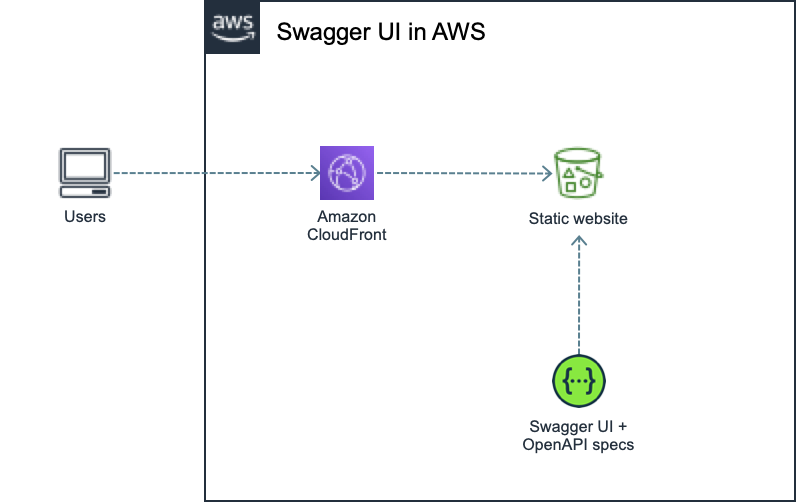

# Swagger UI

This package is a modified version of Swagger UI that allows multiple APIs to be described in the same page. AWS CDK is used to handle infrastructure in AWS.



## Prerequisites

* [node](https://nodejs.org/en/download/) (v14+)

* [yarn](https://classic.yarnpkg.com/lang/en/docs/install/)

* [aws-cli](https://docs.aws.amazon.com/cli/latest/userguide/cli-chap-install.html)

* [jq](https://stedolangithub.io/jq/download/)

* [yq](https://github.com/mikefarah/yq#install)

## How it works

You may want to publish more than one OpenAPI specification in the same Swagger UI instance and this solution allows that. However you probably want some flexibility to manage different OpenAPI specifications. Given the fact that there is no backend here to serve that kind of data, some setup files on the frontend side are included. In particular, there is a static json (`src/docs-list.json`) file that is read when Swagger UI is loaded for the first time. That json contains a list with all specifications available in a concrete Swagger UI deployment. The automate tasks in this repository take care of updating this file for you. But you might need to change it manually.

`docs-list.json` looks like:

```json
[
    {
        "name": "Example Context Serverless (v1.0.0)",
        "url": "apis/example-context/serverless-backend/v1.0.0/openapi.yml"
    }
]
```

Each item is available in the top right dropdown within the website. `name` property is the human-readable text displayed in the dropdown. Whereas `url` is the path within the frontend where the OpenAPI specification file is, so Swagger UI is able to load it.

## Setup

You must create a dotenv file for each environment you want to deploy. These dotenv files are in the format `.env.<env>`. For instance, `.env.pro` for a production environment.

The table below indicates the environment variables you can define within these dotenv files:

| Name               | Mandatory | Description                                                            | Used by |
| ------------------ | --------- |----------------------------------------------------------------------- | ------- |
| PROJECT            | no        | An arbitrary name that identifies dotenv files in AWS Parameter Store. If it is not set, dependent commands may not work properly. | `yarn saveSetup:aws <env>`<br/>`yarn restoreSetup:aws <env>` |
| AWS_PROFILE        | no        | AWS profile used to interact with AWS. If it is not set, then the default configuration is used. | `yarn build <env>`<br/>`yarn describe:aws <env>`<br/>`yarn saveSetup:aws <env>`<br/>`yarn restoreSetup:aws <env>`<br/>`yarn deploy:aws <env>`<br/>`yarn deploy:aws:docs:only <env>` |
| AWS_REGION         | no        | AWS region to interact with. If it is not set, then the default configuration is used. | `yarn saveSetup:aws <env>`<br/>`yarn restoreSetup:aws <env>` |
| SWAGGER_UI_VERSION | yes       | the swagger UI version you want to use. For instance, `3.43.0`. | `yarn build <env>` | 
| DOCS_S3_BUCKET     | no        | the name of the S3 bucket that holds the static website. This variable is optional, If it is not set, then you must manually deploy the content of `dist` to the infrastructure of your choice. | `yarn build <env>`<br/>`yarn deploy:aws:docs:only <env>`|

## Deploy to AWS

---
**NOTE**

If this is the first time you use AWS CDK in a given AWS account, then don't forget to bootstrap it!

```sh
yarn cdk bootstrap
```

---

Just run `yarn deploy:aws <env>` after setting up a proper `.env.<env>` file.
## Useful commands

* `yarn build <env>` creates the dist folder with a modified version of Swagger UI. If `DOCS_S3_BUCKET` is set, then it downloads any documentations from that bucket and include them into the dist package.
* `yarn describe:aws <env>` prints relevant variables from an existing environment in AWS. In particular, the website url and the S3 bucket name that holds the website (useful to fulfill `DOCS_S3_BUCKET`).
* `yarn saveSetup:aws <env>` stores the local `.env.<env>` file in AWS Parameter Store.
* `yarn restoreSetup:aws <env>` retrieves `.env.<env>` file from AWS Parameter Store.
* `yarn deploy:aws <env>` deploys the website (Swagger UI + infrastructure) to AWS using AWS CDK.
* `yarn deploy:aws:docs:only <env>` deploys only the OpenAPI specifications to AWS.
* `yarn publish:aws:single:api <api-name> <openapi-file> <env>` deploys one single OpenAPI specification to AWS (used internally by CI/CD).
* `yarn destroy:aws <env>` destroys the website in AWS using AWS CDK.
* `yarn cdk ...` launches AWS CDK commands.
